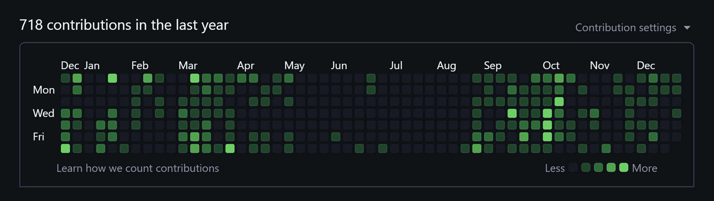

## Overview

https://github.com/s-inoue0108

*[!image] コントリビューションマップ*

**モチベーションの乱高下が激しい！**（夏なんて一切手つけてない）。来年はもう少し自由にコードを書けるかなと思うので、コツコツを心がけたいですね...

## Web プログラミング・Web 制作

Astro, Nuxt.js 等のメタフレームワークを使用したフロントエンドの実装をおもに行いました。来年はさすがにバックエンドも身に着けたいですね。

### Headless CMS を使用したブログサイト

Astro, Vue を使用しました。GSAP によるアニメーションを多用していますが、SSG によりサクサク動作するのがよかったです。

https://si-library.net

### 当サイト

Astro と、JSX の習熟のために SolidJS を採用し、シンプルなつくりにしました。Markdown と自作 CLI によるコンテンツ管理が結構気に入っています。

https://siwl.dev

## ツール

思いがけず、シェルスクリプトを触る機会に恵まれました（指導教員に感謝）。来年はもっと可搬性・可読性に優れた質の高いプログラムを書くよう心がけたいと思います。Go 言語も学習して活用したい。

### Gaussian 関係のテキストファイル処理

https://github.com/s-inoue0108/gen-tddft

研究室で計算化学ソフトウェアの Gaussian を扱っているため、テキストファイル処理の効率化のためのツールを作成しました。研究室に Mac ユーザーが多く、可用性を重視して Perl を使っています。

### Python の活用

Matplotlib や Pandas を使用したデータ処理を行う機会がありました。もっとうまく活用できるようになりたいですね。

## 学業

今年からは研究室生活で、現在の研究室では有機合成メインですが計算科（化）学も活用しています。来年度以降は計算科学一本になるかと思うので、実装力を鍛えていきたいです💪💪💪

## さいごに

今年はいろいろな人々との出会いがあり、プログラムの知識を活用する機会に恵まれたと思います。来年もいい循環を保っていけたらいいなぁ。2025年もどうぞよろしくお願いします🫡