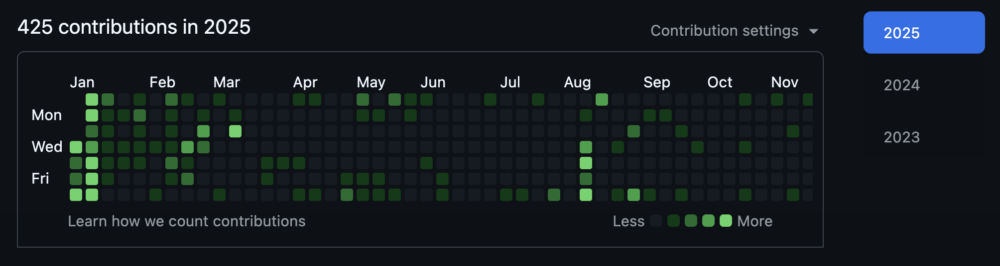

## 個人開発

https://github.com/s-inoue0108

*[!image] Contributions in 2025*

コミット数は 2024 年の 70% ほどに落ちました。また、今年は研究の都合もあり、TypeScript よりも Python を書く機会が多かったです。

### 主な制作物

研究の副産物として、ケモインフォマティクス関係のツールを個人で制作しました。

https://github.com/s-inoue0108/chiropy

Gaussian TD-DFT による励起状態計算と光学特性の解析を効率的に行うための CLI ツールです。NetworkX/Matplotlib を使った分子レンダラーをつけてあります。

https://github.com/s-inoue0108/smiles2mol

SMILES 文字列から分子の立体構造を生成できる CLI ツールです。

## 研究活動

機械学習と分子シミュレーションに関するスキルを新たに習得しました。

### 論文

https://doi.org/10.1093/chemle/upaf140

### 学会活動

ポスター発表を2件行いました。

https://pub.confit.atlas.jp/ja/event/jsap2025a/presentation/7p-P04-6

「スパースモデリングを用いた有機半導体における隣接分子間の二面角予測」(第86回応用物理学会秋季学術講演会, 2025-09-07)

https://festa.csj.jp/2025/program/#ps-P3

「機械学習による有機半導体結晶の隣接分子間の二面角予測」(第15回 CSJ 化学フェスタ 2025, 2025-10-22)

## さいごに

今年は自身にとって最も大切な1年だったと思います。2026 年もどうぞよろしくお願いいたします。