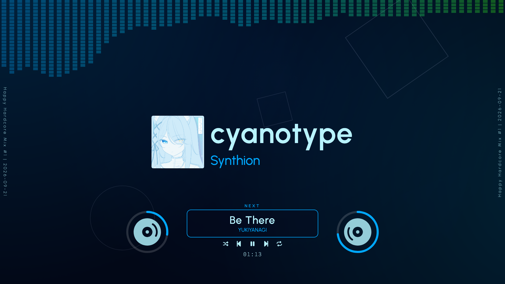

## コードで動画を作る

突然ですが、私は Hardcore techno が大好きです。趣味で DJ コントローラーを触っているのですが、いい感じの Mix が録れた時に「*カッコいい動画にして投稿してぇな〜*」という気持ちが湧いてきます。
動画編集はかなり面倒くさい作業ですし、過去に幾つかの動画編集ソフトを触ったことがありますが、そもそも手持ちにある貧弱なスペックのノート PC では編集時にカクついてお話になりません。
\
そんな折に、何やら React で動画を作れるツールがあるらしいとの話を小耳に挟んだもので、試してみることにしました。それが、今回使った **Remotion** というライブラリです。

https://remotion.dev

はっきり言って便利すぎました。Node.js さえあれば始められて、しかもコードベースなので AI フレンドリーなのが素晴らしいところです。
で、これを使えば **Mix 音源から (ほぼ) 自動で動画を生成できる**んじゃね、ということを思い立ったので、実際に作ったというのが本記事の趣旨です。
\
先に、実際に生成した Mix 動画を置いておきます：

https://www.youtube.com/watch?v=-YiAyMvMrn8

## 要件

今回作りたいのは、DJ Mix 後の音源 (`.wav`) とメタデータ (`.json`)、各種アセット (カバー画像など) を与えると動画 (`.mp4`) を自動でレンダリングするツールです。ディレクトリ構成は以下を想定しています。

```
public/
└── project/
    ├── metadata.json
    ├── mix.wav
    └── covers/
            ├── cover1.jpg
            └── cover2.jpg
```

`metadata.json` は以下のような形式です。Mix のタイトル、オーディオファイルのパス、日付、平均 BPM、オープニングの表示時間 (sec) が記載してあります。
`"tracks"` フィールドには使用した曲のタイトル、コンポーザー名、カバーアートのパス、各曲がスタートする時間 (sec) が格納されています。

```json:metadata.json
{
    "title": "Hardcore Short Mix",
    "audio": "mix.wav",
    "date": "2026-09-21",
    "bpm": 175,
    "opening": 5,
    "tracks": [
        {
            "title": "music 1",
            "composer": "composer 1",
            "cover": "covers/cover1.jpg",
            "duration": {
                "start": 0,
                "end": 60
            }
        },
        {
            "title": "music 2",
            "composer": "composer 2",
            "cover": "covers/cover2.jpg",
            "duration": {
                "start": 60,
                "end": 120
            }
        }
    ]
}
```

将来的には、この辺りのメタデータ生成プロセスも効率化したいと思っています。曲を `.mp3` や `.flac` なんかで保管している場合、それらのメタデータは大抵ファイルのヘッダに埋め込まれており、[FFmpeg](https://ffmpeg.org/) や [metaflac](https://xiph.org/flac/documentation_tools_metaflac.html) なんかで容易に抽出可能です。
\
また Remotion はどうも AI Agent とのバインディングが豊富なようで、巷では Claude Code や Codex なんかと連携して使うやり方が流行っているようでした。
ただ、今回作りたいツールは大層なものでもないので、サクっと手で作ってしまうことにしました[^1]。

[^1]: といっても骨組みはほぼ ChatGPT にプロンプトを打って作ってもらいましたが...

## 主要コンポーネント

以下では、主なコンポーネントの小さい実装を示します。実装全体は以下のリポジトリにあります。

https://github.com/s-inoue0108/remotion-vj

### 画面全体

親に相当するコンポーネントです。ここでは Remotion や周辺ライブラリの API を使って音源に関する情報を拾っていき、Props を介して必要な情報を画面に配置する子コンポーネントに渡していく設計です。

```tsx:Display.tsx
import { AbsoluteFill, Html5Audio, staticFile, useCurrentFrame, useVideoConfig } from "remotion";
import { useAudioData, visualizeAudio } from "@remotion/media-utils";

// スペクトラムビジュアライザ
import { SpectrumVisualizer } from "./SpectrumVisualizer";

export const Display = ({ path, metadata }: Props) => {

    // フレーム, FPS
    const frame = useCurrentFrame();
    const { fps, durationInFrames } = useVideoConfig();

    if (!metadata) {
        return null;
    }

    // メタデータ
    const { title, date, audio, tracks } = metadata;

    // オーディオの読み込み
    const audioSrc = staticFile(
        `${path}/${audio}`,
    );
    const audioData = useAudioData(audioSrc);
    if (!audioData) {
        return null;
    }

    // オーディオスペクトラム (サンプル数=512)
    const frequencies = visualizeAudio({
        fps,
        frame,
        audioData,
        numberOfSamples: 512,
    });

    return (
        <AbsoluteFill>
            <SpectrumVisualizer frequencies={frequencies} />
        </AbsoluteFill>
    )
}
```

実際の実装は以下です。

https://github.com/s-inoue0108/remotion-vj/blob/main/src/deepdark/Deepdark.tsx

### スペクトラムビジュアライザ

今回一番作りたかったのはコレです。~~正直他はおまけみたいなもんです~~
\
スペクトラムビジュアライザ[^2]は音源を周波数ごとに区切って、それぞれの音域の強度を視覚エフェクトとして表示します。

[^2]: ミュージックビジュアライザとかオーディオビジュアライザとか、呼称が定まらない印象。測定機器であるスペクトラムアナライザ (スペアナ) の出力を視覚エフェクトとして用いたものなので、スペアナとも。

アップダウンの激しいダンスミュージック向きの演出で、色とか形状とかを工夫するとド派手な映像を作ることもできそうです。実際、MV ではよく見かける印象。

```tsx:SpectrumVisualizer.tsx
type Props = {
    frequencies: number[];
    displayFrequencies?: number;
    maxBlocks?: number;
};

export const SpectrumVisualizer = ({ frequencies, displayFrequencies = 64, maxBlocks = 80 }: Props) => {
    const visibleFrequencies = frequencies.slice(0, displayFrequencies);
    const blockGap = 2;

    return (
        <div
            style={{
                position: "absolute",
                left: 0,
                top: 0,
                width: "100%",
                height: "100vh",
                display: "flex",
                flexDirection: "row",
                alignItems: "flex-start",
                justifyContent: "space-between",
                overflow: "hidden",
            }}
        >
            {visibleFrequencies.map((value, index) => {
                // フレームごとのブロック数
                const blocks = Math.min(
                    maxBlocks,
                    Math.floor(value * maxBlocks * 4),
                );

                return (
                    <div
                        key={index}
                        style={{
                            display: "flex",
                            flexDirection: "column",
                            alignItems: "center",
                            gap: blockGap,
                            width: `${100 / visibleFrequencies.length}%`,
                        }}
                    >
                        {Array.from({
                            length: blocks,
                        }).map((_, i) => (
                            <div
                                key={i}
                                style={{
                                    width: "60%",
                                    height: "1vh",
                                    backgroundColor: "#fff",
                                }}
                            />
                        ))}
                    </div>
                );
            })}
        </div>
    );
};
```

親である `Display` コンポーネントからは、周波数ごとの強度である `frequencies` が毎フレーム渡ってきます。今回は Hardcore techno 系の曲を想定しているので、周波数帯 を 512 チャネルと多めにとり、そのうち低域側の 64 チャネルのみを使用することで、特徴的な力強いキックを精密に捉えるようにしています。
\
また、ブロック数 `blocks` を計算する `Math.floor()` に倍率を仕込むことで、わずかな音に対してもビジュアライザが鋭敏に反応するようになっています。



*[!image] キックの度に画面上部いっぱいのブロックが波打つ*

### 現在の曲の情報

カバーアート・タイトル・コンポーザー名が表示してあります。中身はほぼ CSS です。
\
以降の実装は割愛するので、GitHub の内容を参照してください。

https://github.com/s-inoue0108/remotion-vj/blob/main/src/deepdark/component/TrackBanner.tsx

### 次の曲の情報

画面下部には次の曲の情報が表示してあり、曲がスイッチするタイミングで Easing するようになっています。

https://github.com/s-inoue0108/remotion-vj/blob/main/src/deepdark/component/NextTrack.tsx

### 背景アニメーション

Hardcore techno 系楽曲の MV で、画面いっぱいにパーティクルや幾何学模様が浮遊する演出、ありますよね (ビデオジョッキーっぽい感じのやつ)。
\
実際、背景がそのままだと寂しかったので、適度なグラデーションと図形が奥から手前に浮かんでくるようなアニメーションを入れました。

https://github.com/s-inoue0108/remotion-vj/blob/main/src/deepdark/component/VJBackground.tsx

### プログレスバー

BPM に合わせて回転するジョグホイールを模したプログレスバーを設置しました。左側のホイールは 8 拍、右側のホイールは 16 拍ごとに一回転するようになっています。

https://github.com/s-inoue0108/remotion-vj/blob/main/src/deepdark/component/ProgressDisc.tsx

## まとめ

かなり気に入ったので、色々なバリエーションを用意して長く使っていけたらと思っています。

- [Remotion-VJ | GitHub](https://github.com/s-inoue0108/remotion-vj)
- [Happy Hardcore Mix #1 【ハピコア】 | YouTube](https://www.youtube.com/watch?v=-YiAyMvMrn8)