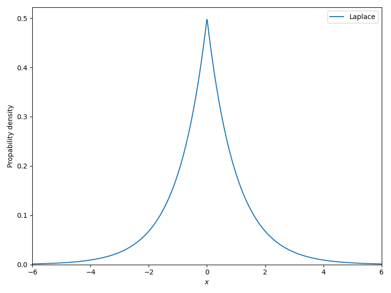
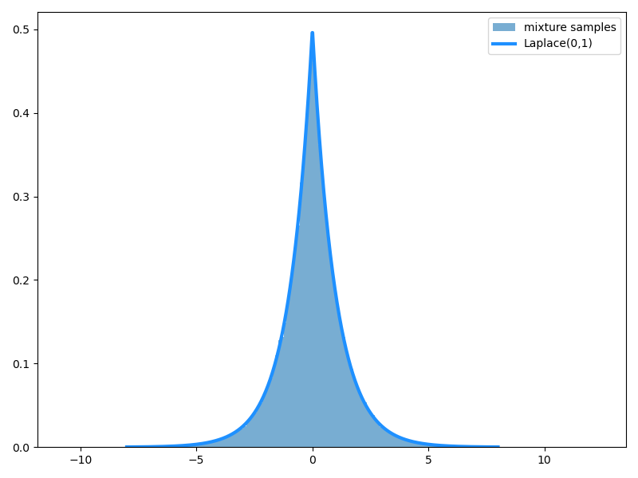
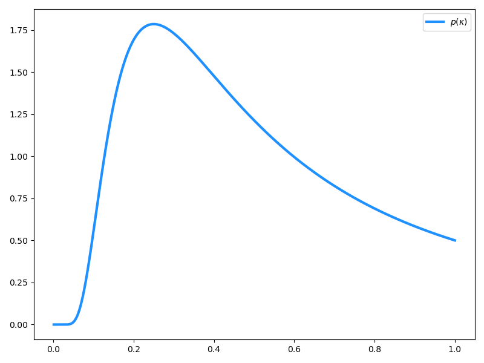
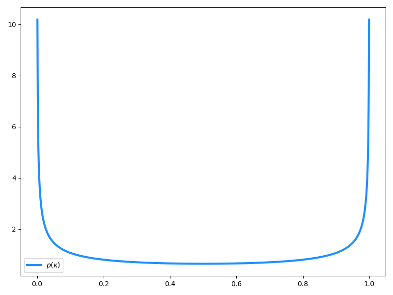

## LASSO の Bayes 的解釈

[こちらの記事](bayesian-modeling-regression)で示したように、LASSO はラプラス事前分布を課した回帰係数の MAP 推定と見なすことができます。

まず、これを示します。ここでは、データ $\mathcal{D} = (X, \bm{y})$：

$$
\begin{aligned}
X      & = [\bm{x}_1, \ldots, \bm{x}_p], \quad \bm{x}_j = [x_1, \ldots, x_N]^\top \\
\bm{y} & = [y_1, \ldots, y_N]^\top
\end{aligned}
$$

に対する線形回帰モデル

$$
\bm{y} = X\bm{\beta} + \bm{\varepsilon}, \quad \bm{\varepsilon} \sim N(\bm{0}, \sigma^2I_N)
$$

を考えます。線形回帰モデルを構成する特徴量 $\bm{x}_j$ について、一部の係数はゼロ ($\beta_j = 0$) であるとみなす仮定を**スパース性**の仮定といい、スパース性を仮定した統計モデリングを総称して**スパースモデリング**といいます。

### Laplace 分布

Laplace 分布 $\mathrm{Laplace}(\mu, b)$ は、以下の確率密度関数：

$$
p_{\mu, b}(x) = \frac{1}{2b} \exp \left( -\frac{|x - \mu|}{b} \right)
$$

で与えられる確率分布で、位置パラメータ $\mu$ と尺度パラメータ $b$ を持ちます。
$\mathrm{Laplace}(0, 1)$ の可視化は以下のようになります。正規分布と比べて裾が重く、ゼロの位置に不連続なピークを持つことがわかります。



> [!info:fold] コード
>
> ```py
> import numpy as np
> import matplotlib.pyplot as plt
> from scipy.stats import laplace
>
> x = np.linspace(-6, 6, 1024)
>
> # Laplace(0, 1)
> laplace_pdf = laplace.pdf(x, loc=0, scale=1)
>
> plt.figure(figsize=(8, 6))
> plt.plot(x, laplace_pdf, label="Laplace")
> plt.xlim(-6, 6)
> plt.ylim(0, None)
> plt.xlabel(r"$x$")
> plt.ylabel("Propability density")
> plt.legend()
> plt.tight_layout()
> plt.show()
> ```

### MAP 推定量としての LASSO

回帰係数 $\bm{\beta} = [\beta_1, \ldots, \beta_p]^\top$ の事前分布として、i.i.d な Laplace 分布：

$$
\beta_j \sim \mathrm{Laplace}(0, b)
$$

を課します。確率密度関数とその対数は、

$$
\begin{aligned}
p(\bm{\beta})     &= \frac{1}{2b} \prod_{j=1}^p \exp \left( -\frac{|\beta_j|}{b} \right) \\
\ln p(\bm{\beta}) &= \ln \frac{1}{2b} - \sum_{j=1}^p \frac{|\beta_j|}{b}
\end{aligned}
$$

です。ここで、線形回帰モデルの対数尤度関数は

$$
\ln p(X|\bm{\beta}) = -\frac{1}{2\sigma^2} || \bm{y} - X\bm{\beta} ||^2 - \frac{N}{2} \ln(2\pi \sigma^2)
$$

ですから、LASSO 推定量 $\hat{\bm{\beta}}_\mathrm{LASSO}$ は適当な $\lambda > 0$ を用いた MAP 推定量として、

$$
\hat{\bm{\beta}}_\mathrm{LASSO} = \argmin_{\bm{\beta}} \left( || \bm{y} - X\bm{\beta} ||^2 + \lambda || \bm{\beta} ||_1 \right)
$$

と表すことができます。ここで

$$
|| \bm{\beta} ||_1 := \sum_{j=1}^p |\beta_j|
$$

を $L_1$-ノルムといいます。

### Bayesian LASSO

LASSO が推定する回帰係数は MAP 推定量、すなわち事後確率が最大となるときのパラメータの値であるため、事後分布 $P(\bm{\beta}|X)$ の点推定 (最頻値) となります。
これに対し、$P(\bm{\beta}|X)$ そのものを推定する方法は **Bayesian LASSO** と呼ばれます。この場合の $P(\bm{\beta}|X)$ は通常解析的でないため、Markov 連鎖モンテカルロ (MCMC) をはじめとするサンプリング法によって推定されます。

### Bayesian LASSO の階層表現

Laplace 分布は $\mathrm{Laplace}(0, b)$ は指数分布と正規分布の混合によって表すことができます。

> [!tip] Laplace 分布の階層表現
> $$
> \begin{aligned}
> \beta_j ~|~ \tau & \sim N(0, \tau) \\
> \tau             & \sim \mathrm{Exp}(1/(2b^2))
> \end{aligned}
> $$

これを (やんわり) 示します。Laplace 分布の密度関数 $p(\beta_j)$ を指数分布のパラメータ $\tau$ で拡大すると、

$$
p(\beta_j) = \int_0^\infty p(\beta_j | \tau)p(\tau) ~ d\tau
$$

となります。正規分布と指数分布の密度関数を明示すると、

$$
\begin{aligned}
p(\beta_j | \tau) & = \frac{1}{\sqrt{2\pi\tau}} \exp \left( -\frac{\beta_j^2}{2\tau} \right) \\
p(\tau)           & = \frac{1}{2b^2} \exp \left( -\frac{\tau}{2b^2} \right)
\end{aligned}
$$

であるので、Gauss 積分公式を使用して

$$
\begin{aligned}
p_b(\beta_j) & = \int_0^\infty \frac{1}{\sqrt{2\pi\tau}} \exp \left( -\frac{\beta_j^2}{2\tau} \right) \frac{1}{2b^2} \exp \left( -\frac{\tau}{2b^2} \right) ~ d\tau \\
             & = \frac{1}{2b^2\sqrt{2\pi\tau}} \int_0^\infty \exp \left( -\frac{\beta_j^2}{2\tau} -\frac{\tau}{2b^2} \right) ~ d\tau \\
             &= \frac{1}{2b} \exp \left( -\frac{|\beta_j|}{b} \right)
\end{aligned}
$$

となります。

指数分布と正規分布からのサンプルで以上の階層表現を構成してみると、確かに $\mathrm{Laplace}(0, 1)$ に近づくことがわかります。



> [!info:fold] コード
>
> ```py
> import numpy as np
> import matplotlib.pyplot as plt
> from scipy.stats import laplace
>
> b = 1.0
> N = 200000
>
> # τ ~ Exp(1/(2b²))
> tau = np.random.exponential(scale=2 * b**2, size=N)
>
> # beta | τ ~ N(0,τ)
> beta= np.random.normal(loc=0, scale=np.sqrt(tau))
>
> x = np.linspace(-8, 8, 1000)
>
> plt.figure(figsize=(8, 6))
> plt.hist(beta, bins=200, density=True, alpha=0.6, label="mixture samples")
>
> plt.plot(x, laplace.pdf(x, scale=b), linewidth=3, label="Laplace(0,1)", color="dodgerblue")
>
> plt.legend()
> plt.tight_layout()
> plt.show()
> ```

この事実を利用すれば、Bayesian LASSO を以下のように階層表現することができます。

> [!tip] Bayesian LASSO の階層表現
> $$
> \begin{aligned}
> \bm{y} ~|~ X, \bm{\beta}, \sigma^2 & \sim N(X\bm{\beta}, \sigma^2I_N) \\
> \beta_j ~|~ \lambda_j, \sigma^2    & \sim N(0, \sigma^2\lambda_j) \\
> \lambda_j                          &\sim \mathrm{Exp}(\tau^2/2)
> \end{aligned}
> $$

実際に用いる場合は、$\sigma^2, \tau$ にも適当な事前分布をおきます (共役事前分布を用いる場合が多いのでしょうか？)。

## 縮小事前分布

次の問題設定を考えてみます。

$$
\begin{aligned}
\bm{y} & = \bm{\beta} + \bm{\varepsilon}, \quad \bm{\varepsilon} \sim N(\bm{0}, \sigma^2I_N) \\
y_j    & = \beta_j + \varepsilon_j
\end{aligned}
$$

そのような $\beta_j ~ (j = 1,\ldots, p)$ の事前分布として、以下の形式の階層表現を導入します。

$$
\begin{aligned}
\beta_j ~|~ \sigma^2, \tau, \lambda_j & \sim N(0, \sigma^2\tau^2\lambda_j^2) \\
\lambda_j                             & \sim P(\cdot)
\end{aligned}
$$

$P(\cdot)$ は適当な確率分布で、たとえば $\mathrm{Exp}$ とすれば Bayesian LASSO に相当します。この形式で表現できる事前分布は線形回帰モデルに $\beta_j \simeq 0$ となるような事前知識を与えます。そのような理由から、**縮小事前分布**と呼ばれるようです。

なお、$\sigma^2, \tau, \lambda_j$ が所与である場合、事後分布は正規分布になります ([こちらの記事](https://qard.is.tohoku.ac.jp/T-Wave/bocs-sa/)を参照)。

### 縮小係数

$\sigma^2 = 1$ とし、$\tau, \lambda_j$ が所与のもとで $\beta_j$ の事後平均は以下のようになります：

$$
\mathbb{E}[\beta_j ~|~ y_j, \tau, \lambda_j^2] = \frac{\tau^2\lambda_j^2}{1 + \tau^2\lambda_j^2}y_j
$$

ここで、

$$
\kappa_j := \frac{1}{1 + \tau^2\lambda_j^2}
$$

を**縮小係数**などと呼び、$\tau^2\lambda_j^2 > 0$ であることから $0 < \kappa_j < 1$ の範囲を取ります。事後平均を縮小係数で書き直すと、

$$
\mathbb{E}[\beta_j ~|~ y_j, \tau, \lambda_j^2] = (1 - \kappa_j)y_j
$$

となることから、**縮小係数 $\kappa_j$ はシグナル $y_j$ をどれくらい圧縮するかを決めるパラメータ**であることがわかります。また、

- $\tau$ は $\kappa_1, \ldots, \kappa_p$ 全てに寄与するパラメータ
- $\lambda_j$ は $\kappa_j$ のみに寄与するパラメータ

であることから、$\tau$ を**大域縮小パラメータ**、$\lambda_j$ を**局所縮小パラメータ**などと呼びます。

### Laplace 分布と縮小係数

Laplace 分布の問題点は、任意の回帰係数 $\beta_j$ で縮小が起きやすくなってしまう点にあります。この問題が起きる理由は、Laplace 分布に対応する $\kappa_j$ の事前分布を見ることで理解できます。
\
Laplace 分布の階層表現における局所縮小パラメータ $\lambda_j$ に対して、

$$
\lambda_j = \frac{1 - \kappa_j}{\kappa_j}
$$

とすると縮小係数を定義できます。$\lambda_j \sim \mathrm{Exp}(\tau^2/2)$ であるので、その確率密度関数は

$$
p_\tau(\lambda_j) = \frac{\tau^2}{2} \exp \left( -\frac{\tau^2}{2}\lambda_j \right)
$$

と表すことができます。変数変換 $\lambda_j \to \kappa_j$ に伴う Jacobian は

$$
\left| \frac{\partial \lambda_j}{\partial \kappa_j} \right| = \left| \frac{\partial}{\partial \kappa_j} \frac{1 - \kappa_j}{\kappa_j} \right| = \frac{1}{\kappa_j^2}
$$

であるので、

$$
p_\tau(\kappa_j) = \frac{\tau^2}{2\kappa_j^2} \exp \left( -\frac{\tau^2}{2} \frac{1 - \kappa_j}{\kappa_j} \right)
$$

を得ます。$\tau = 1$ としてこれをプロットしたのが以下の図です。



> [!info:fold] コード
>
> ```py
> import numpy as np
> import matplotlib.pyplot as plt
>
> # kappa
> kappa = np.linspace(0, 1, 1024)
>
> # p(kappa)
> prob = np.exp((kappa - 1)/(2 * kappa)) / (2 * kappa**2)
>
> plt.figure(figsize=(8, 6))
> plt.plot(kappa, prob, linewidth=3, label=r"$p(\kappa)$", color="dodgerblue")
> plt.legend()
> plt.tight_layout()
> plt.show()
> ```

図から明らかなように、Laplace 分布は $\kappa_j \simeq 0$ の近辺に密度をほとんど持たず、それゆえ多くの係数がゼロに縮退してしまいます。

### 馬蹄分布

強いスパース性を担保しつつも過剰縮小を抑えるためには、$\kappa_j \simeq 0$ および $\kappa_j \simeq 1$ に密度を集中させれば良いことがわかります。$\kappa_j$ の事前分布としてベータ分布 $\mathrm{Beta}(1/2, 1/2)$ をとると、そのような性質を満足することができます。確率密度関数は以下で与えられます：

$$
p(\kappa_j) = \frac{1}{\pi} \frac{1}{\sqrt{\kappa_j(1 - \kappa_j)}}
$$

これをプロットしたものは以下のようになります。



> [!info:fold] コード
>
> ```py
> import numpy as np
> import matplotlib.pyplot as plt
>
> # kappa
> kappa = np.linspace(0, 1, 1024)
>
> # p(kappa)
> prob = (1 / np.pi) * (1 / np.sqrt(kappa * (1 - kappa)))
>
> plt.figure(figsize=(8, 6))
> plt.plot(kappa, prob, linewidth=3, label=r"$p(\kappa)$", color="dodgerblue")
> plt.legend()
> plt.tight_layout()
> plt.show()
> ```

関数形が馬の蹄 (ひづめ) のように見えることから、これに対応する $\beta_j$ の事前分布は**馬蹄分布**と呼ばれます。局所縮小パラメータ $\lambda_j$ と大域縮小パラメータ $\tau$ をもつ馬蹄分布は以下の階層表現で表すことができます。

> [!tip] 馬蹄分布の階層表現
>
> $$
> \begin{aligned}
> \beta_j ~|~ \sigma^2, \tau, \lambda_j & \sim N(0, \sigma^2\tau^2\lambda_j^2) \\
> \tau                                  & \sim \mathrm{HalfCauchy}(0, 1) \\
> \lambda_j                             & \sim \mathrm{HalfCauchy}(0, 1)
> \end{aligned}
> $$

$\mathrm{HalfCauchy}(0, 1)$ は位置パラメータ $0$、尺度パラメータ $1$ の (標準) 半 Cauchy 分布で、確率密度関数は以下で与えられます：

$$
p(x) =
\begin{cases}
1 / (\pi (1 + x^2)) & (x > 0) \\
0                   & (x < 0)
\end{cases}
$$

これを利用して、馬蹄事前分布をおいた Bayes 線形回帰を以下のような階層表現で定式化できます。

> [!tip] 馬蹄分布による Bayes 線形回帰
>
> $$
> \begin{aligned}
> \bm{y} ~|~ X, \bm{\beta}, \sigma^2    & \sim N(X\bm{\beta}, \sigma^2 I_N) \\
> \beta_j ~|~ \sigma^2, \tau, \lambda_j & \sim N(0, \sigma^2\tau^2\lambda_j^2) \\
> \tau                                  & \sim \mathrm{HalfCauchy}(0, 1) \\
> \lambda_j                             & \sim \mathrm{HalfCauchy}(0, 1)
> \end{aligned}
> $$

### 馬蹄分布の逆ガンマ表現

馬蹄分布のデメリットとして、半 Cauchy 事前分布の性質上、解析的な事後分布を得にくい点が挙げられます。この問題に対処するため、解析的な事後分布を得やすい逆ガンマ分布 $\mathrm{InvGamma}(a, b)$ で半 Cauchy 分布を書き直すことができます。
\
形状パラメータ $a$、尺度パラメータ $b$ を持つ逆ガンマ関数の確率密度関数は以下です：

$$
p_{a,b}(x) = \frac{b^a}{\Gamma(a)}\frac{1}{x^{a + 1}}\exp \left( -\frac{b}{x} \right)
$$

なお、$\Gamma(t)$ はガンマ関数です。逆ガンマ分布を用いた半 Cauchy 分布の表現は以下のようになります。

> [!tip] 半 Cauchy 分布の逆ガンマ表現
>
> $$
> x \sim \mathrm{HalfCauchy}(0, \gamma)
> $$
>
> にしたがう確率変数 $x$ に対し、潜在確率変数 $z$ を導入することで、
>
> $$
> \begin{aligned}
> x^2 ~|~ z & \sim \mathrm{InvGamma}(1/2, 1/z) \\
> z         & \sim \mathrm{InvGamma}(1/2, 1/\gamma^2)
> \end{aligned}
> $$

これを用いると、$\tau, \lambda_j$ にそれぞれ対応する補助変数 $\xi, \nu_j$ を用意して、

> [!tip] 馬蹄分布の逆ガンマ表現
>
> $$
> \begin{aligned}
> \beta_j ~|~ \sigma^2, \tau, \lambda_j & \sim N(0, \sigma^2\tau^2\lambda_j^2) \\
> \tau^2 ~|~ \xi                        & \sim \mathrm{InvGamma}(1/2, 1/\xi) \\
> \xi                                   & \sim \mathrm{InvGamma}(1/2, 1) \\
> \lambda_j^2 ~|~ \nu_j                 & \sim \mathrm{InvGamma}(1/2, 1/\nu_j) \\
> \nu_j                                 & \sim \mathrm{InvGamma}(1/2, 1)
> \end{aligned}
> $$

という階層表現を得ることができます。$\sigma^2$ の事前分布も逆ガンマ分布を使えば、馬蹄分布をすべて逆ガンマ分布で表現できたことになります。正規分布の分散パラメータに対応する共役事前分布は逆ガンマ分布ですから、このように構成した馬蹄分布は事後分布の一部もまた逆ガンマ分布で表現できます。

## References

### 2次情報

- 縮小事前分布、特に馬蹄分布に関する導入を参考にしました。

https://qard.is.tohoku.ac.jp/T-Wave/bocs-sa/

- 続き物の記事です。大変参考になりました。

https://qiita.com/ssugasawa/items/b0abce4681f1fcb3216e

また、サンプルコードや数学的補足は一部 ChatGPT から生成しました。

### 論文等

1. T. Park and G. Casella, *The Bayesian Lasso*, *J. Am. Stat. Assoc.*, **103**, 681–686 (2008).
2. C. M. Carvalho *et al.*, *Handling Sparsity via the Horseshoe*, *Proc. Mach. Learn. Res. (PMLR)*, **5**, 73–80 (2009).
3. C. M. Carvalho, J. G. Scott. *The horseshoe estimator for sparse signals*, *Biometrika*, **97**, 465–480 (2010).
4. E. Makalic and D. F. Schmidt, *A simple sampler for the horseshoe estimator*, *IEEE Signal Process. Lett.*, **23**, 179–182 (2016).