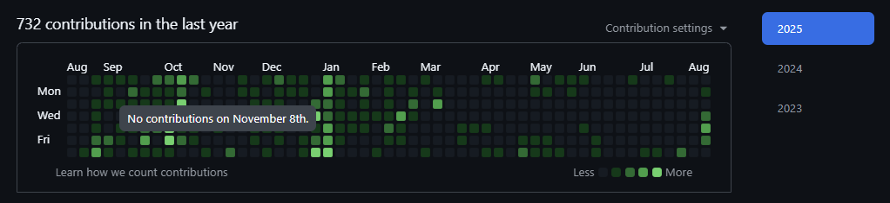
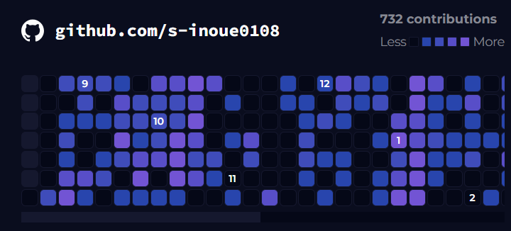

やり方は以下の Zenn の記事を参考にしています。

https://zenn.dev/yuichkun/articles/b207651f5654b0

## API トークンを発行する

あらかじめ、GitHub の開発者向け設定ページから User の情報の読み出し権限を備えた API Token を発行する必要があります。

https://github.com/settings/tokens

発行した API Token を環境変数に控えておきます。

```dotenv:.env
GITHUB_ACCESS_TOKEN=ghp_*****
```

## GraphQL API でカレンダーを取得

### cURL から叩く

以下の GraphQL を使ってコントリビューションカレンダーを取得できます。

```json:query.txt
{
  "query":
    "query($user: String!) {
      user(login: $user) {
        contributionsCollection {
          contributionCalendar {
            totalContributions
            weeks {
              contributionDays {
                date
                contributionCount
              }
            }
          }
        }
      }
    }",
    "variables": {
      "user": "hoge"
    }
}
```

`user` フィールドの値には API Token を発行したときの GitHub ユーザー名を設定します。

cURL で GraphQL API を叩いてレスポンスを確認します。エンドポイントは `https://api.github.com/graphql` です。また、リクエストヘッダーに先で発行した API Token を含めます。

```bash:ターミナル
curl https://api.github.com/graphql \
-H "Authorization: Bearer ghp_*****" \
-d @query.txt
```

### Astro に API クライアントを実装する

以上の API リクエストを行う仕組みを Astro サイトに実装します。

Astro コンポーネントは GraphQL クライアントを追加で必要とせず、フロントマターに `fetch` を書くだけでサーバサイドで API をたたいてくれます。

https://docs.astro.build/ja/guides/data-fetching/#graphql%E3%82%AF%E3%82%A8%E3%83%AA

また、コレクションの取得期限 (`$to` と `$from`) を明示的に指定できます。

```astro:Astro
---
interface Calendar {
  totalContributions: number;
  weeks: {
    contributionDays: {
      contributionCount: number;
      date: string;
    }[];
  }[];
}

const response = await fetch("https://api.github.com/graphql", {
	method: "POST",
	headers: {
		"Content-Type": "application/json",
		Authorization: `Bearer ${import.meta.env.GITHUB_ACCESS_TOKEN}`,
	},
	body: JSON.stringify({
		query: `
			query($user: String!, $from: DateTime!, $to: DateTime!) {
				user(login: $user){
					contributionsCollection(from: $from, to: $to) {
						contributionCalendar {
							totalContributions
							weeks {
								contributionDays {
									contributionCount
									date
								}
							}
						}
					}
				}
			}
		`,
		variables: {
			user: "hoge",
			from: "yyyy-MM-ddTHH:mm:ss",
			to: "yyyy-MM-ddTHH:mm:ss",
		},
	}),
});

const contributions = await response.json();
const calendar: Calendar = contributions.data.user.contributionsCollection.contributionCalendar;
---
```

## UI を作る

煮るなり焼くなりしていい感じの見た目に整えます。当サイトでは実際のカレンダーを踏襲した UI を実装してみました。



*[!image] オリジナル*




*[!image] 実装した UI*

実際の UI を以下のページから見ることができます。

https://siwl.dev/about/