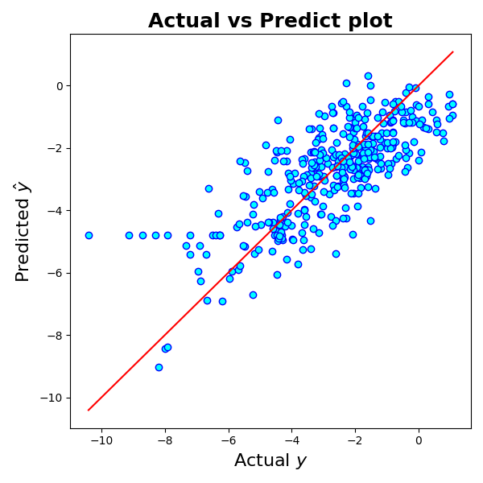

## 重回帰モデル

### 定義

説明変数の組 $\bm{x} = [x_1, x_2, \ldots, x_p]^\top$ を用いて目的変数 $y$ を予測する次の1次式モデル：

$$
y = \beta_0 + \beta_1 x_1 + \cdots \beta_p x_p + \varepsilon
$$

を用いる場合、モデルは**重回帰モデル**とよばれ、線形回帰の基本的な形式です。ここで $\bm{\beta} = [\beta_0, \beta_1, \beta_2, \ldots, \beta_p]^\top$ は各説明変数の重みで、これを回帰係数といいます。

また、$\varepsilon$ は誤差項で、たいていは正規分布にしたがう場合 ($\varepsilon \sim N(0, \sigma^2)$) を仮定します（Gauss-Markov モデル）。

### 最小二乗法

重回帰モデルでは、$\bm{\beta}$ の推定量 $\hat{\bm{\beta}} = [\hat{\beta_0}, \hat{\beta_1}, \hat{\beta_2}, \ldots, \hat{\beta_p}]^\top$ をデータを使用して求めることを行います。いま、サイズ $n$ のデータセット：

$$
\bm{X} = \begin{bmatrix} 1 & x_{11} & x_{12} & \cdots & x_{1p} \\ 1 & x_{21} & x_{22} & \cdots & x_{2p} \\ \vdots & \vdots & \vdots & \ddots & \vdots \\ 1 & x_{n1} & x_{n2} & \cdots & x_{np} \end{bmatrix}, \quad \bm{y} = \begin{bmatrix} y_1 \\ y_2 \\ \vdots \\ y_n \end{bmatrix}
$$

を重回帰モデルにあてはめると、

$$
\bm{y} = \bm{X}\bm{\beta} + \bm{\varepsilon}
$$

となります（$\bm{\varepsilon} = [\varepsilon_1, \varepsilon_2, \ldots, \varepsilon_n]^\top \sim N(\bm{0}, \Sigma^2)$）。いま、回帰の程度を評価する指標（損失関数 $L$）として、平均二乗誤差（MSE）：

$$
\operatorname{MSE} = \frac{1}{n}\sum_{i = 1}^n {\varepsilon_i}^2 = \frac{1}{n} || \bm{y} - \bm{X}\bm{\beta} ||^2
$$

を考えます。最小二乗法は、MSE を最小化するような $\bm{\beta}$ として推定量 $\hat{\bm{\beta}}$ を求める手法です。すなわち、

$$
\hat{\bm{\beta}} = \argmin_{\bm{\beta} \in \mathbb{R}^{p + 1}} \operatorname{MSE}(\bm{\beta}) \Longleftrightarrow \frac{\partial}{\partial \bm{\beta}} \operatorname{MSE}(\bm{\beta}) = \bm{0} \Longleftrightarrow \frac{\partial}{\partial \bm{\beta}} || \bm{y} - \bm{X}\bm{\beta} ||^2 = \bm{0}
$$

が $\hat{\bm{\beta}}$ を求めるための条件となります。これを計算すると、

$$
\hat{\bm{\beta}} = (\bm{X}^\top \bm{X})^{-1} \bm{X}^\top \bm{y}
$$

を得ます。

> [!tip:fold] 導出
>
> $$
> || \bm{y} - \bm{X}\bm{\beta} ||^2 = \bm{y}^\top \bm{y} - 2\bm{y}^\top \bm{X} \bm{\beta} + \bm{\beta}^\top \bm{X}^\top \bm{X} \bm{\beta}
> $$
>
> の各項の微分を考えると、
>
> $$
> \frac{\partial}{\partial \bm{\beta}} \bm{y}^\top \bm{y} = \bm{0}
> $$
>
> $$
> \frac{\partial}{\partial \bm{\beta}} 2\bm{y}^\top \bm{X} \bm{\beta} = (2 \bm{y}^\top \bm{X})^\top = 2\bm{X}^\top \bm{y}
> $$
>
> $$
> \frac{\partial}{\partial \bm{\beta}} \bm{\beta}^\top \bm{X}^\top \bm{X} \bm{\beta} = \frac{\partial \bm{X \beta}}{\partial \bm{\beta}} \frac{\partial}{\partial \bm{X \beta}}(\bm{X} \bm{\beta})^\top \bm{X} \bm{\beta} = \bm{X}^\top (2 \bm{X} \bm{\beta}) = 2 \bm{X}^\top \bm{X} \bm{\beta}
> $$
>
> であるから、
>
> $$
> \frac{\partial}{\partial \bm{\beta}} || \bm{y} - \bm{X}\bm{\beta} ||^2 = -2\bm{X}^\top \bm{y} + 2 \bm{X}^\top \bm{X} \bm{\beta} = \bm{0}
> $$
>
> $$
> \therefore \hat{\bm{\beta}} = (\bm{X}^\top \bm{X})^{-1} \bm{X}^\top \bm{y}
> $$
>
> ※ベクトルの微分については[このページ](https://manabitimes.jp/math/2719)などを参照

### 最尤法

最尤法は、パラメータ $\bm{\theta}$ による対数尤度関数：

$$
\log L(\bm{\theta}) = \sum_{i=1}^n \log f(y_i | \bm{\theta})
$$

を最大化することで $\hat{\bm{\beta}}$ を推定する手法です。

ただし、$f(y_i | \bm{\theta})$ はデータ $y_i$ をサンプリングした確率分布の確率密度関数です。Gauss-Markov 重回帰モデルでは、$y_i$ に対応する確率変数 $Y_i$ について $Y_i \sim N(\bm{x}_i\bm{\beta}, \sigma^2)$ ですから、$f(y_i | \bm{\theta})$ は正規分布の確率密度関数になります：

$$
f(y_i | \bm{x}_i\bm{\beta}, \sigma^2) = \frac{1}{\sqrt{2\pi \sigma^2}} \exp \left[ -\frac{(y_i - \bm{x}_i \bm{\beta})^2}{2\sigma^2} \right]
$$

したがって、対数尤度関数は

$$
\log L(\bm{\beta}) =  -\frac{1}{2\sigma^2} ||\bm{y} - \bm{X}\bm{\beta}||^2 - \frac{n}{2} \log 2\pi\sigma^2
$$

となります。これを $\bm{\beta}$ の変化に対して最大化することを考えると、$\bm{\beta}$ に依存する部分は第一項の $||\bm{y} - \bm{X}\bm{\beta}||^2$ ですから、

$$
\frac{\partial \log L(\bm{\beta})}{\partial \bm{\beta}} = \bm{0} \Longleftrightarrow \frac{\partial}{\partial \bm{\beta}} || \bm{y} - \bm{X}\bm{\beta} ||^2 = \bm{0} \Longleftrightarrow \hat{\bm{\beta}} = (\bm{X}^\top \bm{X})^{-1} \bm{X}^\top \bm{y}
$$

となって、**最小二乗推定量と最尤推定量は一致する**ことがわかります。

### 決定係数

目的変数の予測値を $\hat{\bm{y}}= {\bm{X}}^\top \hat{\bm{\beta}}$ とします。また、目的変数の平均 $\bar{y} = (1 / n) \sum_{i=1}^n y_i$ を定義するとき、**決定係数** $R^2$ は次のように書くことができます。

$$
R^2 = 1 - \frac{|| \bm{y} - \hat{\bm{y}} ||^2}{|| \bm{y} - \bar{y} \bm{1} ||^2}, \quad \bm{1} := [1, 1, \ldots, 1]^\top \in \mathbb{R}^n
$$

## 正則化線形回帰モデル

説明変数が多い場合、線形回帰モデルが**過学習 (Overfitting)** を起こしてしまう場合があります。これを抑えるため、目的関数である MSE に**正則化項**と呼ばれる項を加えたものを損失関数として最小化する手法が知られています。

### Lasso 回帰

**Lasso 回帰モデル**では MSE に加えて $L_1$-ノルムを用いた正則化項を導入した損失関数を最小化します。

$$
\hat{\bm{\beta}}_\mathrm{Lasso} = \argmin_{\bm{\beta} \in \mathbb{R}^{p + 1}} \left( \operatorname{MSE}(\bm{\beta}) + \lambda \sum_{j = 1}^p |\beta_j| \right)
$$

$\lambda$ は正則化項の重みで、ユーザーが恣意的に決定するハイパーパラメータです。

### Ridge 回帰

**Rigde 回帰モデル**では MSE に加えて $L_2$-ノルムを用いた正則化項を導入した損失関数を最小化します。

$$
\hat{\bm{\beta}}_\mathrm{Ridge} = \argmin_{\bm{\beta} \in \mathbb{R}^{p + 1}} \left( \operatorname{MSE}(\bm{\beta}) + \frac{\alpha}{2} \sum_{j = 1}^p {\beta_j}^2 \right)
$$

同様に $\alpha$ は正則化項の重みで、ユーザーが恣意的に決定するハイパーパラメータです。係数 $1/2$ は微分の都合上導入しています。

### ElasticNet 回帰

**ElasticNet 回帰モデル** は Lasso 回帰と Ridge 回帰の混合モデルです。

$$
\hat{\bm{\beta}}_\mathrm{ElasticNet} = \argmin_{\bm{\beta} \in \mathbb{R}^{p + 1}} \left( \operatorname{MSE}(\bm{\beta}) + \alpha \left( \rho \sum_{j = 1}^p |\beta_j| + \frac{1 - \rho}{2} \sum_{j = 1}^p {\beta_j}^2 \right) \right)
$$

ハイパーパラメータは正則化項全体の重みを決める $\alpha$ と、$L_1$ 正則化の比率を決める $\rho$ の二つになります。

## Python による重回帰モデルの実装

ここでは、分子の SMILES と物理化学データを用いた重回帰モデルを Scikit-learn で実装してみましょう。

データセットは、[『化学のための Python によるデータ解析・機械学習入門 第1版』](https://www.amazon.co.jp/%E5%8C%96%E5%AD%A6%E3%81%AE%E3%81%9F%E3%82%81%E3%81%AE-Python%E3%81%AB%E3%82%88%E3%82%8B%E3%83%87%E3%83%BC%E3%82%BF%E8%A7%A3%E6%9E%90%E3%83%BB%E6%A9%9F%E6%A2%B0%E5%AD%A6%E7%BF%92%E5%85%A5%E9%96%80-%E9%87%91%E5%AD%90-%E5%BC%98%E6%98%8C/dp/4274224414) における「有機化合物の水溶解度データセット」を利用させていただきます。

https://github.com/hkaneko1985/python_data_analysis_ohmsha/blob/master/sample_data/molecules_with_logS.csv

また、Python ライブラリは以下のものを使用しました。

- NumPy `1.26.4`
- Pandas `2.2.2`
- Scikit-learn `1.5.0`
- RDKit `2023.9.6`

### 特徴量の構築

物理化学的に、分子の水溶解度は $\mathrm{OH}$ 基の数などの特徴量と相関があると推測できます。そこで、`RDkit` の `Chem.Lipinski` モジュールを用い、分子の Lipinski パラメータ[^1]を特徴量として使用します。

[^1]: Lipinski パラメータについては、https://www.chem-station.com/blog/2015/02/sp3.html などを参照してください。

> [!info:fold] コード
> 
> ```py
> import numpy as np
> import pandas as pd
> from rdkit import Chem
> from rdkit.Chem import Lipinski
> 
> # データの URL
> url = "https://raw.githubusercontent.com/hkaneko1985/python_data_analysis_ohmsha/refs/heads/master/sample_data/molecules_with_logS.csv"
> 
> # データフレームとして読み込む
> df = pd.read_csv(url, index_col=0)
> 
> # MOL オブジェクト
> mols = [Chem.MolFromSmiles(smiles) for smiles in df["SMILES"]]
> 
> # Lipinski パラメータで特徴量を作る
> features = pd.DataFrame(
>     [
>         {
>             "FractionCSP3": Lipinski.FractionCSP3(mol),
>             "NHOHCount": Lipinski.NHOHCount(mol),
>             "NOCount": Lipinski.NOCount(mol),
>             "NumAliphaticCarbocycles": Lipinski.NumAliphaticCarbocycles(mol),
>             "NumAliphaticHeterocycles": Lipinski.NumAliphaticHeterocycles(mol),
>             "NumAliphaticRings": Lipinski.NumAliphaticRings(mol),
>             "NumAromaticCarbocycles": Lipinski.NumAromaticCarbocycles(mol),
>             "NumAromaticHeterocycles": Lipinski.NumAromaticHeterocycles(mol),
>             "NumAromaticRings": Lipinski.NumAromaticRings(mol),
>             "NumRotatableBonds": Lipinski.NumRotatableBonds(mol),
>             "NumSaturatedCarbocycles": Lipinski.NumSaturatedCarbocycles(mol),
>             "NumSaturatedHeterocycles": Lipinski.NumSaturatedHeterocycles(mol),
>             "NumSaturatedRings": Lipinski.NumSaturatedRings(mol),
>             "NumHAcceptors": Lipinski.NumHAcceptors(mol),
>             "NumHDonors": Lipinski.NumHDonors(mol),
>         }
>         for mol in mols
>     ],
>     index=df.index,
> )
> 
> # 結合
> dataset = pd.concat([df["logS"], features], axis=1)
> ```

### 前処理

データセットを $7:3$ の比率でトレーニングデータとテストデータへ分割し、正規化を行います。ここでは、Min-Max スケーリング：

$$
x_{j, \mathrm{scaled}} = \frac{x_j - x_{j, \mathrm{min}}}{x_{j, \mathrm{max}} - x_{j, \mathrm{min}}}, \quad x_j \in [x_1, x_2, \ldots, x_p]^\top
$$

を用います。

> [!info:fold] コード
> 
> ```py
> # 前処理
> from sklearn.model_selection import train_test_split
> from sklearn.preprocessing import MinMaxScaler
> 
> # データの分割
> train, test = train_test_split(dataset, test_size=0.3, random_state=42)
> 
> # 説明変数と目的変数を分離
> X_train, y_train = train.drop("logS", axis=1), train["logS"].to_numpy()
> X_test, y_test = test.drop("logS", axis=1), test["logS"].to_numpy()
> 
> # 正規化
> scaler = MinMaxScaler()
> X_train = scaler.fit_transform(X_train)
> X_test = scaler.transform(X_test)
> ```

### 学習と予測

前処理したトレーニングデータセットでモデルを構築し、テストデータセットで予測を行います。

> [!info:fold] コード
>
> ```py
> from sklearn.linear_model import LinearRegression
> from sklearn.metrics import r2_score
> 
> # 学習
> model = LinearRegression()
> model.fit(X_train, y_train)
> 
> # 予測と決定係数の計算
> y_pred = model.predict(X_test)
> score = r2_score(y_test, y_pred)
> ```

テストデータによる予測では $R^2 = 0.568$ となりました。

### 性能評価

モデルがどのくらいの予測精度となったかを、散布図で確認してみます。

> [!info:fold] コード
>
> ```py
> import matplotlib.pyplot as plt
> 
> fig = plt.figure(figsize=(6, 6))
> ax = fig.add_subplot(1, 1, 1)
> 
> ax.set_title("Actual vs Predict plot", size=18, weight="semibold")
> ax.set_xlabel(r"Actual $y$", size=16)
> ax.set_ylabel(r"Predicted $\hat{y}$", size=16)
> 
> # 散布図
> ax.scatter(y_test, y_pred, color="cyan", edgecolors="blue")
> 
> # 回帰直線
> x = np.linspace(y_test.min(), y_test.max())
> y = x
> ax.plot(x, y, color="red")
> 
> plt.tight_layout()
> plt.savefig("actual_pred.png")
> plt.show()
> ```



*[!image] 予測精度の可視化*

おおむね悪くはなさそうですが、図の左下に大きく予測が外れたエントリーがあることがわかります。こういったデータを精査して得た情報は、より優れたモデルを構築するためにフィードバックできます。