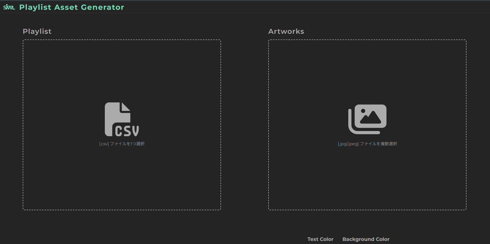

## ツールの紹介

https://playlist-asset-generator.vercel.app

### 概要

**ブラウザのみで動作**し、楽曲のメタデータを含む CSV とアルバムやシングルのカバー画像（JPEG）の組から SVG を生成します。

> [!important] CSV について
> 
> カンマ区切りです。各カラムは FLAC ファイルが含むメタデータを参考に定義してあり、以下のヘッダーを含んでいます。
>
> ```csv:CSV
> FILENAME,ARTIST,TITLE,ALBUM,GENRE,TRACKNUMBER,DATE,ALBUMARTIST,COMPOSER,FLACPATH
> ```
>
> このうち、画像生成に利用しているのは ARTIST, TITLE, ALBUM, DATE の 4 つですが、ロードする CSV にはすべてのカラムを欠損のないように含める必要があります。セルは空白でも構いません。

### プレビュー



*[!image] プレビュー*

## アプローチと技術選定

プレイした楽曲のメタデータ（タイトル、アーティスト名、アルバム名など）を格納した CSV の列とカバー画像の組から生成することを考えました。

<br />

楽曲を FLAC や ALAC のような形式で管理している場合、ファイルにメタデータが付属しています。したがって、楽曲ファイル（FLAC を利用しました）そのものからデータを取り出すインタフェースまで TypeScript で構築することを試みましたが、~~面倒そうだったので~~ 諦めました。

> [!tip]
> 
> FLAC ファイルからデータを取り出す処理はシェルスクリプトで実装しています（[metaflac](https://xiph.org/flac/documentation_tools_metaflac.html) という FLAC 公式のコマンドツールを使うことで FLAC ファイルの中身を CLI で読み出すことができます）。

### UI ライブラリ

Vite を利用することとし、UI 構築には好奇心から**SolidJS**を使ってみました。

https://www.solidjs.com/

SolidJS は React によく似ていますが、小規模なアプリケーションであればよりシンプルに記述できると感じます。特に Hooks まわりは、`useState`（SolidJS では `createSignal`）が追加ライブラリを必要とせずにグローバルステートを宣言できるなど、使いやすい部分が多い気がします。

```ts:state
import { createSignal } from "solid-js";

export const [state, setState] = createSignal();
// Reactとは異なり、ステートはメソッドとして呼び出す: state()
```

#### SolidJSの参考記事

https://zenn.dev/nakasyou/articles/20231020_solidjs

https://qiita.com/tonio0720/items/ad2c33d9bea57435f5ea

### 画像生成

Vercel が開発している [satori](https://github.com/vercel/satori) を使用し、SVG をクライアントサイドで生成できるようにしました。

## 実装

### ドラッグ & ドロップを行う UI

CSV をドロップする部分のみ書きます。`csv()` を外部ファイルにステートとして保存します。

```ts:csvステート
import { createSignal } from "solid-js";

export const [csv, setCsv] = createSignal("");
export const [isDroped, setIsDroped] = createSignal(false);
```

ドロップゾーンの要素に `onDrop={(e) => drop(e)}` としてイベントハンドラを定義します。イベントハンドラの内容は以下です：

```ts:dropイベントハンドラ
const drop = async (e: DragEvent) => {
  e.preventDefault();
  if (e.dataTransfer && !isDroped()) {
    setIsDroped(true);
    if (e.dataTransfer.files.length !== 1) {
      return;
    }
    const file = e.dataTransfer.files[0];
    const ext = file.name.split(".").pop();
    if (ext !== "csv") {
      return;
    }
    const text = await getTextFromFile(file); // FileReader API
    setCsv(text);
  }
};
```

`isDroped()` はステートであり、ファイルがドロップされた後にドロップゾーンをロックする役割を果たします。
また、`getTextFromFile` メソッドは FileReader API を使用して CSV を `string` として読みだしています。

```ts:getTextFromFile
const getTextFromFile = (file: File, encoding: string = "utf-8") => {
  return new Promise<string>((resolve, reject) => {
    const reader = new FileReader();

    reader.onload = () => {
      resolve(reader.result as string);
    }
    reader.onerror = (error) => {
      reject(error);
    }
    reader.readAsText(file, encoding);
  });
};
```

### CSV の Parse

JS で CSV を取り扱うベストプラクティスはこれといったものがなさそうです。安直ですが、行を改行文字で、列をコンマで区切って取り出したデータをオブジェクト配列にマッピングすることでパースします。

```ts:parser.ts
// キーとその型を定義
const cols = {
  ARTIST: "",
  TITLE: "",
  ALBUM: "",
}
type Cols = typeof cols;

export const parser = (csv: string) => {
  const lines = text.split("\n");
  const headers = Object.fromEntries(lines[0].split(",").map((h) => [h, h]))
  const entries: Cols[] = [];

  // 渡されたCSVのヘッダーが定義されたキーと合致するか検証
  const isValid = Object.keys(cols).some((key) => {
    return key in headers;
  });
  if (!isValid) return [];

  const entryLines = lines.slice(1);
  for (let i = 0; i < entryLines.length; i++) {
    if (entryLines[i] === "") continue;
    const entry = Object.fromEntries(entryLines[i].split(",").map((col, idx) => [Object.keys(cols)[idx], col])) as Cols;
    entries.push(entry);
  };
  return [headers, ...entries] as Cols[];
}
```

### CSV からプレビュー用のテーブルを作る

`parser()` の返り値の型は `{.....}[]` ですが、JSX に展開する場合は 2 次元配列 `[.....][]` のほうがおそらく扱いやすいです。そのための変換を行います（~~二度手間感はぬぐえませんが~~） 。

```ts:tableData
import { createMemo } from "solid-js";

const tableData = createMemo(() => {
  return parser(csv()).map((entry) => {
    return Object.values(entry);
  });
});
```

`createMemo` は React の `useRef`、Vue の `computed` に相当するフックのようです。すなわち、コールバックに含まれるステートの値が変更された場合にのみ再計算を行います。

ステートの値に関わらず、更新があった場合に毎回再計算を行うのであれば、SolidJS では単にメソッドを書くだけでよいようです。

```ts:tableData
const tableData = () => {
  return parser(csv()).map((entry) => {
    return Object.values(entry);
  });
}
```

`<table>` 要素に展開します。

```tsx:table
<table>
  <thead>
    {table().slice(0, 1).map((row) => (
      <tr>
        {row.map((val) => (
          <th>{val}</th>
        ))}
      </tr>
    ))}
  </thead>
 <tbody>
    {table().slice(1).map((row) => (
      <tr>
        {row.map((val) => (
          <td>{val}</th>
        ))}
      </tr>
    ))}
  </tbody>
</table>
```

### satori による画像生成

今回はクライアントサイドで処理してしまいます。UI は JSX で実装していますが、satori でも JSX を用いようとしてうまくいかなかったので、DOM はオブジェクトで記述しています。

```ts:satoriによる画像生成
export const generateSvg = async (entry) => {
  // fonts
  const noto400 = await fetch("/fonts/NotoSansJP-Regular.ttf").then((resp) =>
    resp.arrayBuffer()
  );
  const svg = await satori(
    // DOM
    {
      type: "div",
      props: {
        style: {
          fontWeight: 700,
          fontSize: "5rem",
          letterSpacing: "2px",
        },
        children: entry.TITLE,
      },
    },
    // setting
    {
      width: 1440,
      height: 240,
      fonts: [
        {
          name: "Noto Sans JP",
          data: noto400,
          weight: 400,
	  style: "normal",
        },
      ],
    }
  );
  return svg;
}
```

フォントは `/public` へ配置し、Fetch API で読み込んでいます。上記のメソッドを実行するボタンも作っておきます。

```tsx:画像生成ボタン
// 外部に実装しておきます: const [svgs, setSvgs] = createSignal([]);
export default function GenerateBtn() {
  const getSvgs = async (entries) => {
    const processor = async (entries) => {
      return await Promise.all(entries.map(async (entry, idx) => {
        return { svg: await generateSvg(entry), idx }
      }));
    }
  }
  const svgs = await processor(entries);
  setSvgs(svgs);

  return (
    <button type="button" onClick={() => getSvgs(parser(csv()))}>生成</button>
  );
}
```

### 画像プレビューとダウンロード

せっかくなのでモーダルで実装してみます。調べてみると、SolidJS にはモーダルを手軽に実装するための API が提供されています。

```tsx:モーダル
import { Portal } from "solid-js/web";
import { Show } from "solid-js";

export default function Modal() {
  return (
    <Portal>
      <Show when={svgs().length > 0)}>
        <ul>
	  {banners().map((banner, idx) => (
	    <li id={`svg-${idx + 1}`} innerHTML={banner}></li>
	  ))}
	</ul>
      </Show>
    </Portal>
  );
}
```

このようにすることで `svgs()` に要素が格納されているときのみモーダルが表示されます。最後に SVG をダウンロードするボタンを作ります。

```tsx:ダウンロードボタン
// 外部に実装しておきます: const [svgs, setSvgs] = createSignal([]);
export default function DownloadBtn() {
  const onDownload = (entries) => {
    const processor = async (node: ChildNode, fileName: string) => {
      const text = new XMLSerializer().serializeToString(node);
      const blob = new Blob([svgText], { type: "image/svg+xml" });
      const url = URL.createObjectURL(blob);

      const a = document.createElement("a");
      a.href = svgUrl;
      a.download = fileName;

      document.body.appendChild(a);
      a.click();
      document.body.removeChild(a);

      URL.revokeObjectURL(url);
    }
    svgs().forEach((_, idx) => {
      const svgId = document.getElementById(`svg-${idx + 1}`)!.firstChild!;
      processor(svgId, `picture-${idx + 1}.svg`);
    });
  }
  return (
     <button type="button" onClick={onDownload}>ダウンロード</button>
  );
}
```
